# ResuMate（レジュメイト）

**AIがキャリアアドバイザーのように“あなたの経験”を棚卸しし、求人に刺さる履歴書・職務経歴書へと引き出してくれるWebサービスです。**

「自分には大した経験なんてない」——そう思っていても、応募先が求めることに沿ってプロのアドバイザーと話すと、実は評価される経験をたくさんしていた、ということがよくあります。ResuMate は、その“棚卸し対話”をAIが担い、職務経歴・自己PR・志望動機をぐっとリッチにします。

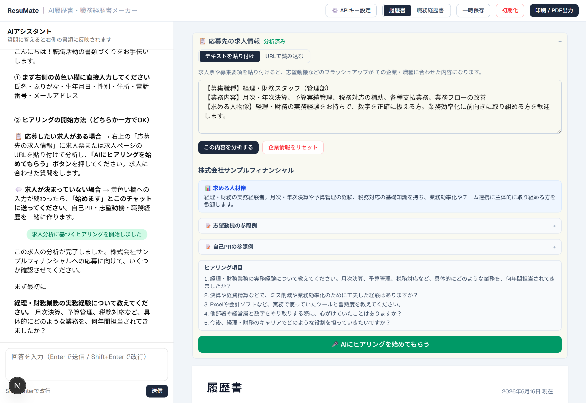

---

## 💡 一番の特徴：求人を分析して、AIがインタビューで強みを引き出す

応募先に合わせて、AIがあなたの強みを“質問”で掘り起こします。これが ResuMate の中心となる体験です。

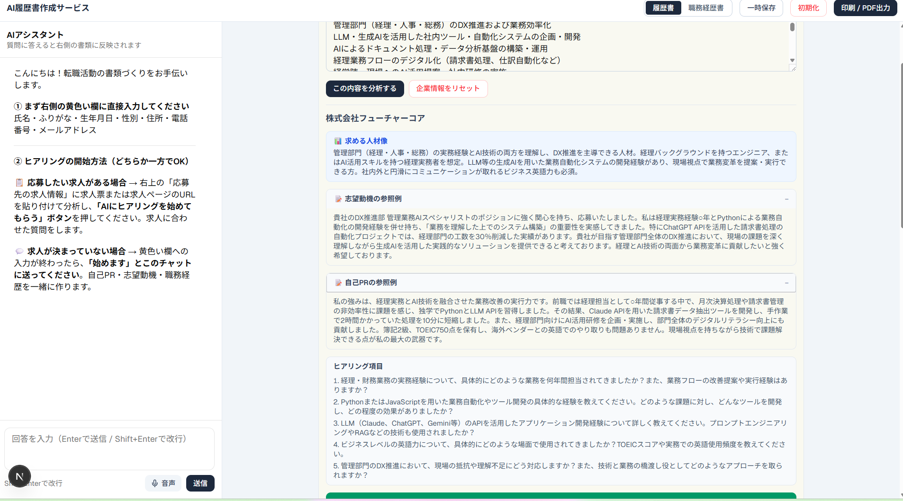

**使い方の流れ**

1. **求人を貼る** — 「応募先の求人情報」欄に、求人票のテキストか会社ページのURLを貼り付け、**「この会社を分析する」**を押します。
2. **AIが会社を分析** — その企業が**求める人物像・求める経験**をAIが読み解き、参考になる**志望動機・自己PRのお手本**まで提示します。
3. **AIインタビューを受ける** — **「AIにヒアリングを始めてもらう」**を押すと、分析結果に基づき、キャリアアドバイザーのようにAIが質問。答えていくだけで、**職務経歴・自己PR・志望動機**が書類に反映されていきます。

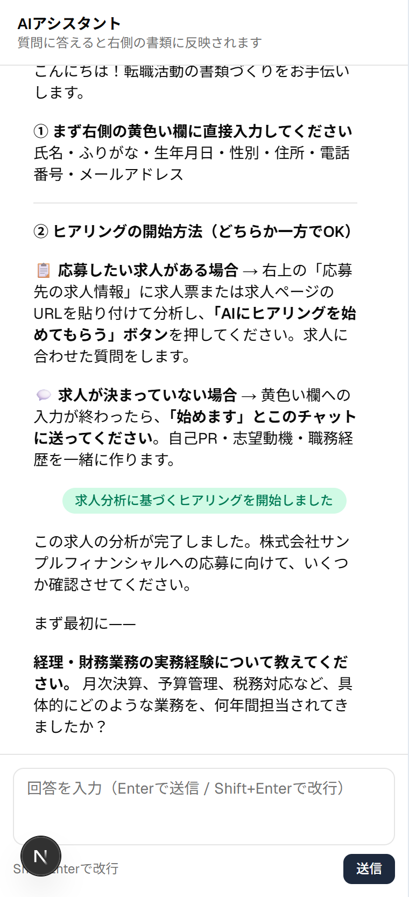

*↑「AIにヒアリングを始めてもらう」を押すと、分析結果をふまえてAIがキャリアアドバイザーのように質問を開始します。答えていくだけで、職務経歴・自己PR・志望動機が書類に反映されていきます。*

> 氏名・学歴などの“形式的に決まっている項目”もAIに指示して埋められますが、そこは手で入力した方が早いので、**黄色の欄はご自身で入力する設計**にしています。AIには「あなたにしか語れない経験」の言語化に集中してもらう、という考え方です。

---

## 🧰 そのほかの機能

- **📸 証明写真をPCで撮影** — 手持ちの写真をアップロードできるほか、PCのカメラでその場で撮影もできます（背景を合成）。※試験的な機能のため、部屋の背景と合成色が近いとうまく切り抜けないことがあります。
- **🏠 住所の自動入力** — 郵便番号を入れると住所候補を自動表示。
- **💾 一時保存・初期化・印刷/PDF出力** — 作業内容はブラウザに自動保存。完成したらそのまま印刷・PDF化できます。
- **✨ どの欄も「自分で編集」＋「AIブラッシュアップ」** — 出力が“もう一歩”と感じたら、各欄を手で直すことも、その欄だけをAIに磨き直してもらうこともできます。
- **📄 履歴書 / 職務経歴書の両対応** — タブひとつで切り替え。
- **🔑 自分のAPIキーで動く（BYOK）** — **Anthropic（Claude）** または **OpenAI（ChatGPT）** を選び、ご自身のAPIキーを入力して利用します。キーは**お使いのブラウザの中だけ**に保存され、運営側のサーバーには保存されません。

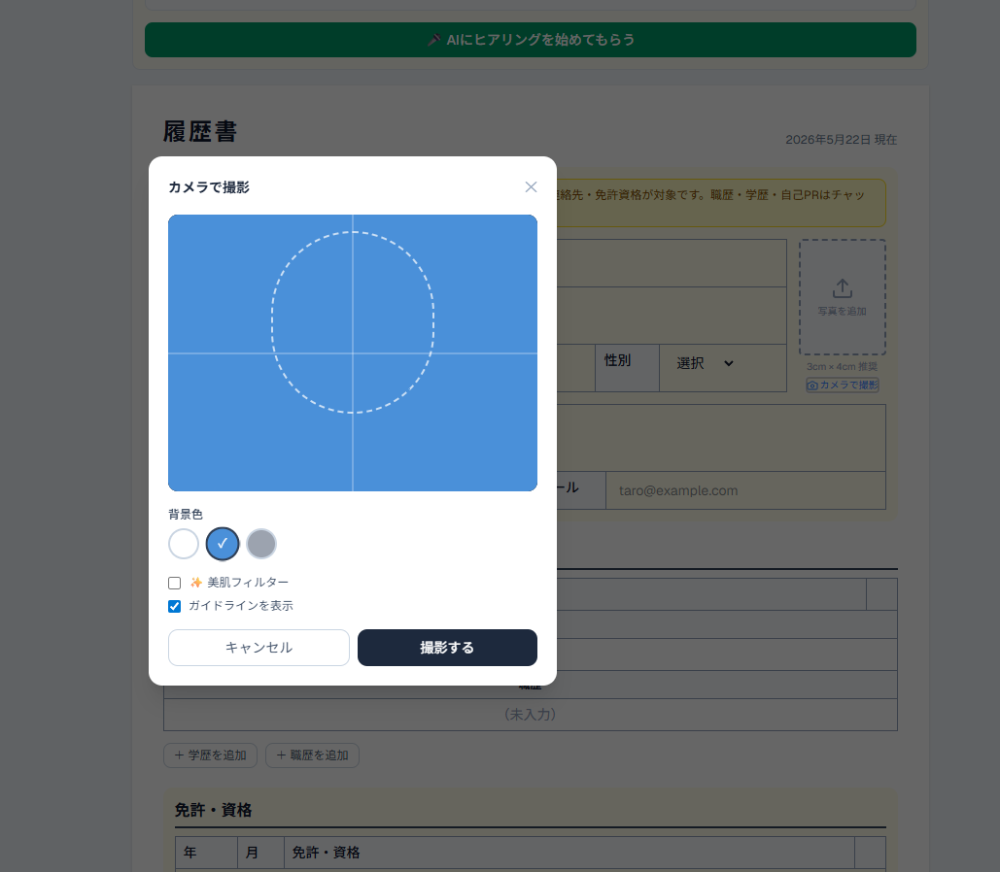

---

## 📸 画面ギャラリー

| | |
| :---: | :---: |
| <br>**AIインタビュー開始（全体）** | <br>**AIがキャリアアドバイザーのように質問** |
| 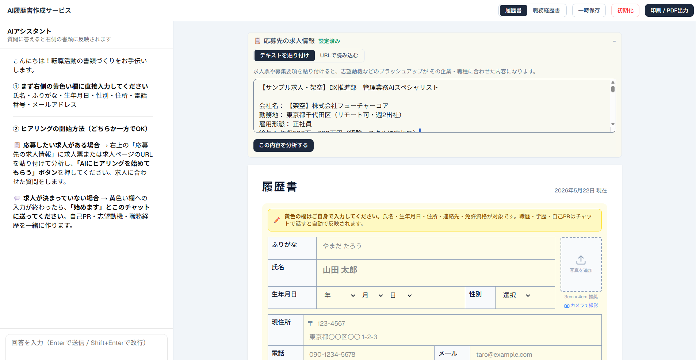<br>**全体画面** | 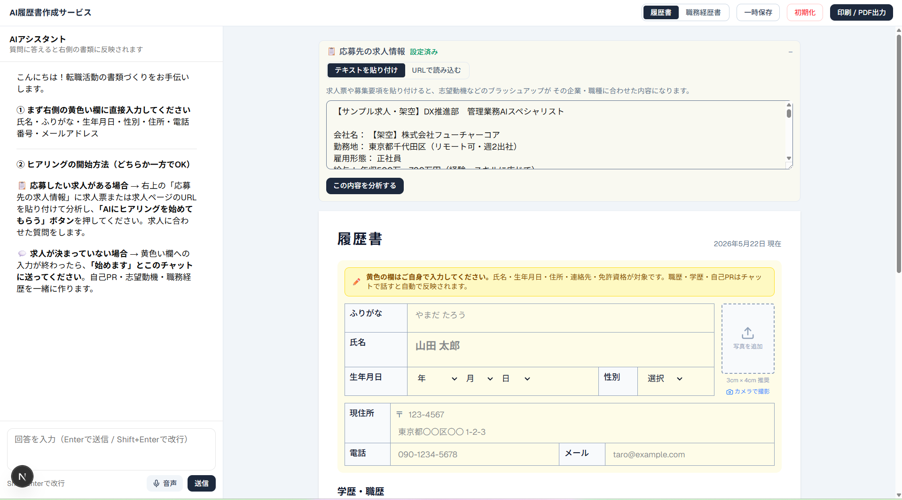<br>**求人票を貼り付け** |
| 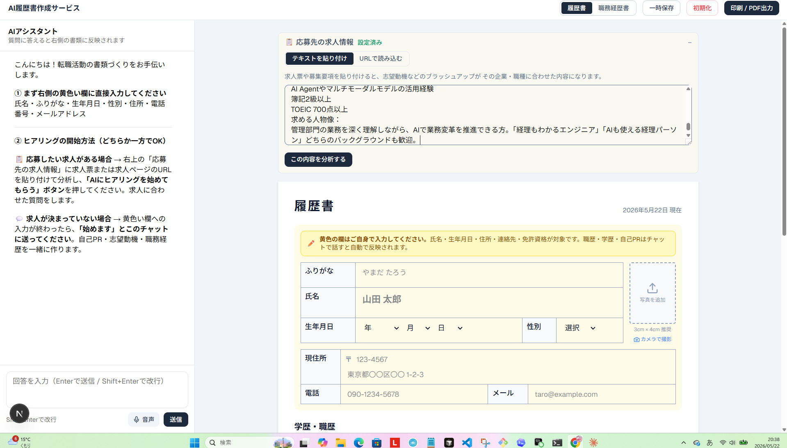<br>**求める人材像の分析** | <br>**志望動機・自己PRのお手本** |
| <br>**ヒアリング項目とインタビュー開始** | 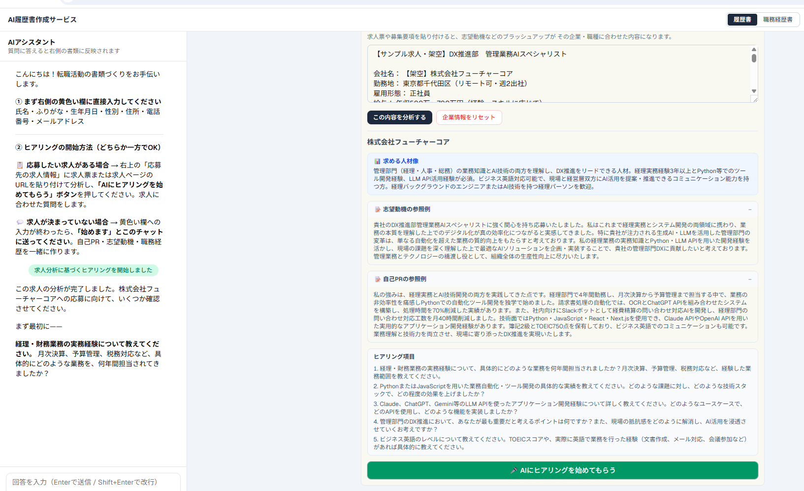<br>**分析結果と書類** |
| 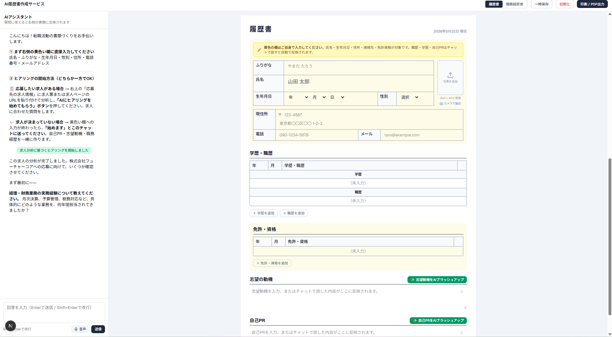<br>**チャットと履歴書** | 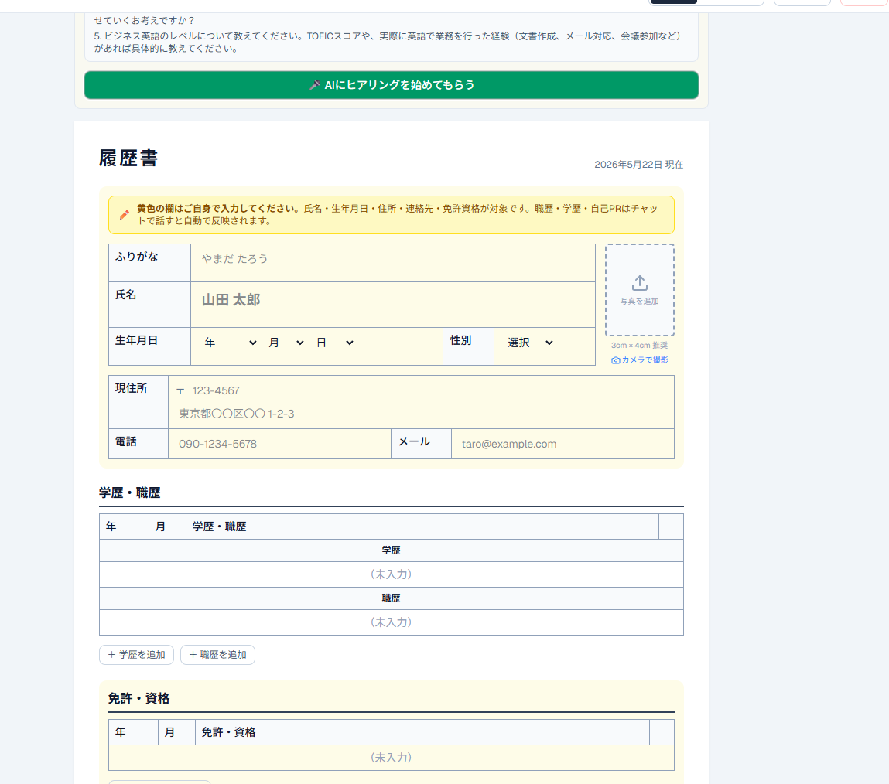<br>**履歴書フォーム（黄色い欄は自分で入力）** |
| 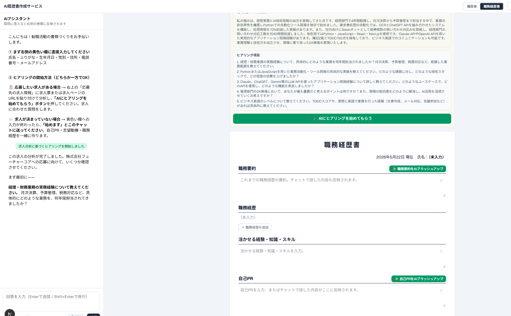<br>**職務経歴書フォーム** | <br>**証明写真をPCで撮影** |

---

## 🚀 はじめ方

1. 画面右上の **「⚙️ APIキー設定」** を開き、プロバイダ（Anthropic / OpenAI）を選んでご自身のAPIキーを入力します。
   - Anthropic のキー: https://console.anthropic.com/settings/keys
   - OpenAI のキー: https://platform.openai.com/api-keys
2. 右側の黄色い欄に、氏名・生年月日・住所・連絡先などの基本情報を入力します。
3. 「応募先の求人情報」に求人票またはURLを貼り付けて分析 → **「AIに求人分析を踏まえてヒアリングしてもらう」**。
   （応募先がまだ決まっていない場合は、「② 履歴書作成」の **「AIに棚卸しを始めてもらう」** からそのまま相談を始められます。）
4. AIの質問に答えるだけで、職務経歴・自己PR・志望動機が書類に反映されます。
5. 必要に応じて各欄を手直し or **「✨ AIブラッシュアップ」** で磨き、**「印刷 / PDF出力」** で書き出します。

---

## 🛠️ 技術スタック

- [Next.js 16](https://nextjs.org/)（App Router / Turbopack）+ React 19
- TypeScript
- [Vercel AI SDK v6](https://sdk.vercel.ai/) — `@ai-sdk/anthropic` / `@ai-sdk/openai`
- Tailwind CSS v4
- Zod（AIの構造化出力スキーマ）
- 証明写真の背景合成: MediaPipe Selfie Segmentation
- ホスティング: Vercel

---

## 💻 ローカルで動かす

```bash
npm install
npm run dev
# http://localhost:3000 を開く
```

APIキーはサーバー側の環境変数ではなく、**ブラウザの「⚙️ APIキー設定」から入力**します（環境変数の設定は不要です）。

---

## 🔒 セキュリティ・プライバシー（このアプリで最も大切にしている点）

履歴書には氏名・住所・連絡先などの大切な個人情報が含まれます。ResuMate は、それらを守ることを最優先に設計しています。

- **AIに送るのは「キャリア情報」だけ** — AIへ渡すのは職歴・学歴・資格・スキル・自己PRなど**仕事に関わるキャリア情報だけ**です。**氏名・住所・電話・メール・生年月日などの個人情報は、AIに送信しません。**
  - ※「**画像読み取り**」（履歴書・職務経歴書のスクリーンショット／撮影から学歴・職歴を取り込む機能）を使うときだけは、**画像そのものがあなたご自身のAIに送られます**。氏名・住所などの個人情報が映らないよう（必要な部分だけを写す／紙などで隠す）にしてからご利用ください。読み取り結果にも個人情報は取り込みません（学歴・職歴・職務経歴のみ）。
- **あなた自身のAPIキーで動く（BYOK: Bring Your Own Key）** — AIへのリクエストは、あなたが設定したご自身のAPIキーで行われます。入力されたAPIキーは、利用者本人のブラウザの `localStorage` にのみ保存されます。
- **サーバーに保存しない** — APIキーも履歴書の内容も、**あなたのブラウザの中だけ**に保存されます。リクエストはサーバーを経由してAIプロバイダへ渡されますが、**サーバー側には一切保存・記録されません**。ログインも不要です。
- **いつでも消せる** — 共用のパソコンを使う場合は、設定画面の「キーを削除」からいつでもキーを消去できます。履歴書の内容も「初期化」で削除できます。

---

*この作品は、プログラミング講座の学習成果として制作しました。*
