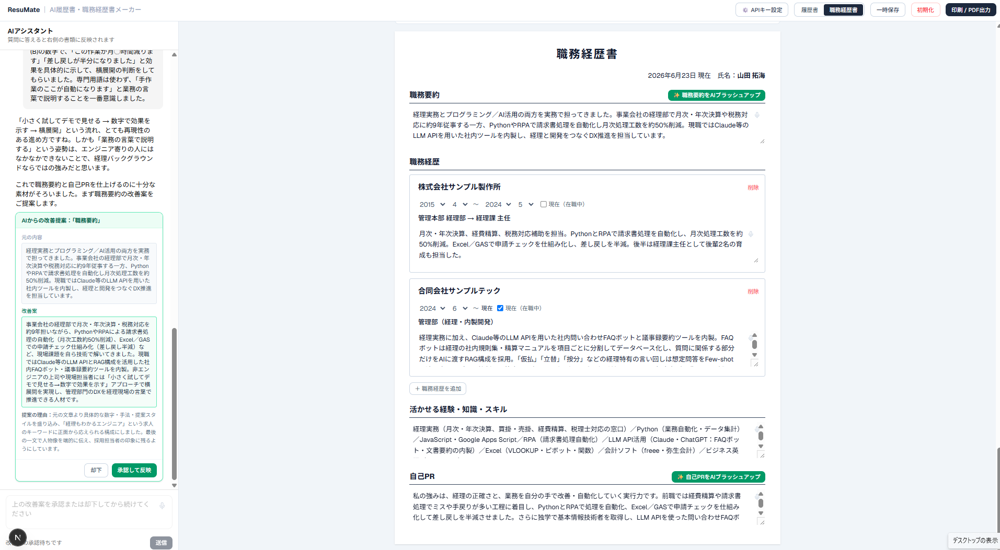
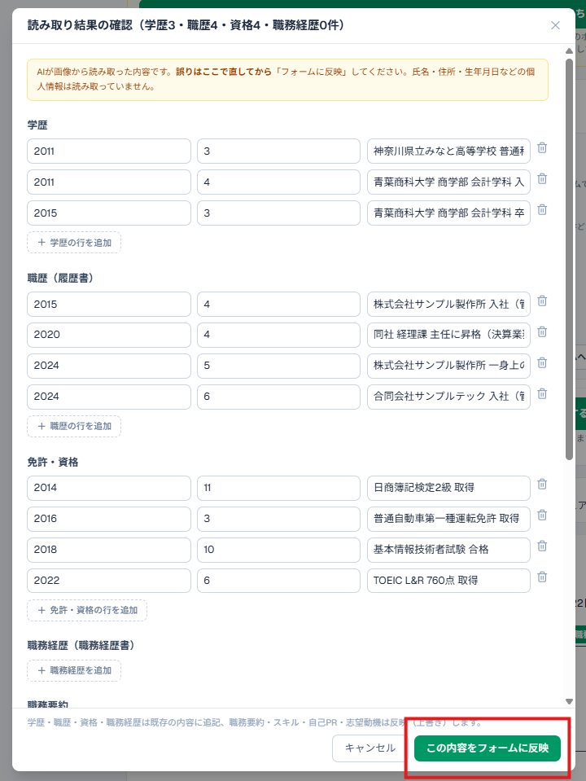
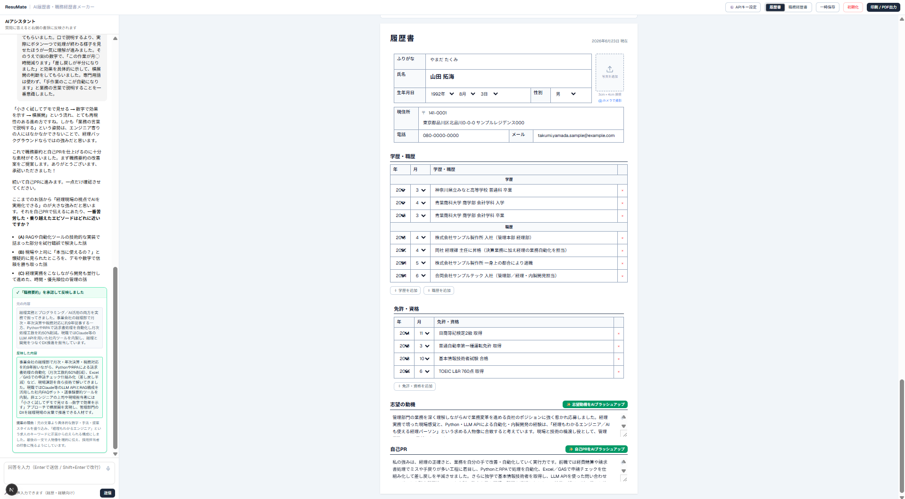
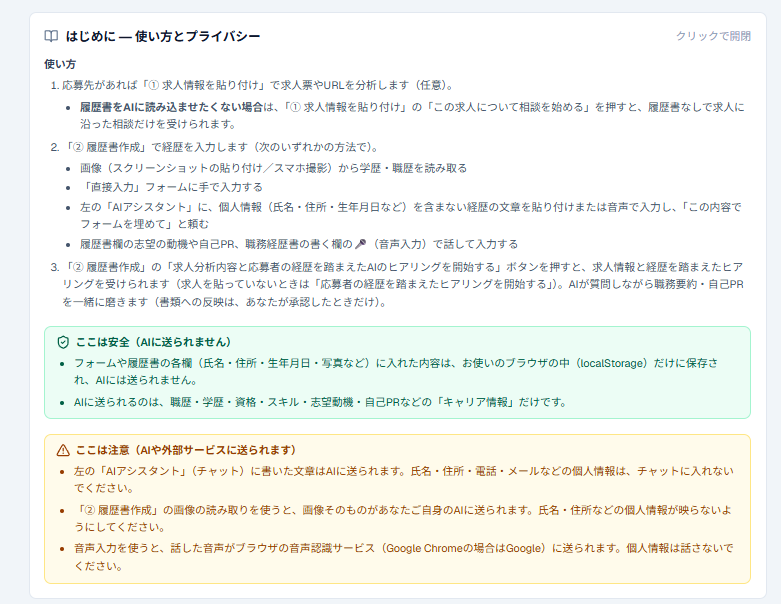
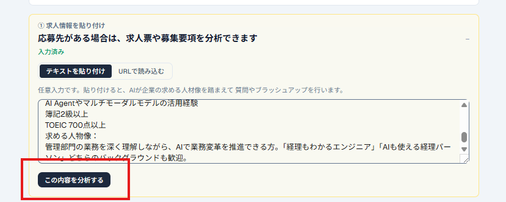
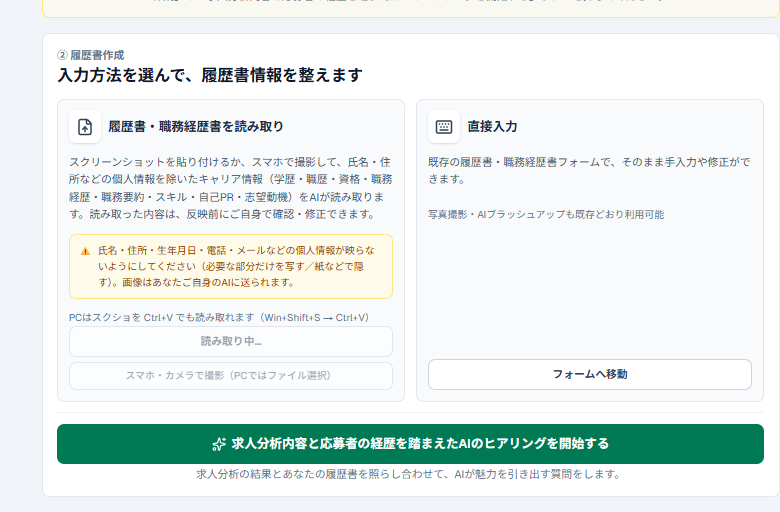

# ResuMate（レジュメイト）

**求人を分析し、AIがキャリアアドバイザーのように“あなたの経験”を引き出して、求人に刺さる履歴書・職務経歴書へと仕上げるWebサービスです。**

「自分には大した経験なんてない」——そう思っていても、応募先が求めることに沿ってプロのアドバイザーと話すと、実は評価される経験をたくさんしていた、ということがよくあります。ResuMate は、その“棚卸し対話”をAIが担い、職務要約・自己PR・志望動機をぐっとリッチにします。


---

## 💡 一番の特徴：求人を分析して、AIがインタビューで強みを引き出す

応募先に合わせて、AIがあなたの強みを“質問”で掘り起こします。これが ResuMate の中心となる体験です。

**使い方の流れ**

1. **① 求人を貼る（任意）** — 「① 求人情報を貼り付け」に、求人票のテキストか会社ページのURLを貼り付けて分析。その企業が**求める人物像**と、参考になる**志望動機・自己PRのお手本**をAIが提示します。
2. **② 履歴書を作る** — 「② 履歴書作成」で経歴を入力します（方法は下記の4通り）。
3. **AIヒアリングを受ける** — 「**求人分析内容と応募者の経歴を踏まえたAIのヒアリングを開始する**」を押すと、求人とあなたの経歴を照らし合わせて、AIがキャリアアドバイザーのように質問。答えていくだけで、**職務要約・自己PR**がより魅力的になります（書類への反映は**あなたが承認したときだけ**）。



> 🔒 **履歴書をAIに読み込ませたくない方へ** — 「① 求人情報を貼り付け」の **「この求人について相談を始める」** を押せば、履歴書を渡さずに、求人に沿った相談だけを受けることもできます。

---

## 🆕 画像から履歴書を読み取り（OCR）

過去の履歴書・職務経歴書の**スクリーンショット**や**スマホで撮った写真**から、氏名・住所などの個人情報を除いた**キャリア情報（学歴・職歴・資格・職務経歴・職務要約・スキル・自己PR・志望動機）**をAIが読み取り、フォームに転記します。

- 読み取り方法は **スクリーンショットの貼り付け（Ctrl+V対応）** と **スマホ・カメラで撮影** の2通り。
- 読み取った内容は**確認画面でチェック・修正してから**反映します。
- **氏名・住所・生年月日などの個人情報は読み取りません**（読み取り結果に項目として持ちません）。画像が個人情報を含む場合は、その部分が映らないようにしてからご利用ください。



---

## 🧰 そのほかの機能

- **✍️ 入力は4通り** — ①画像から読み取り ②直接入力フォーム ③左の「AIアシスタント」に個人情報を含まない経歴文を貼り付け／音声で入力して「フォームを埋めて」と依頼 ④履歴書の志望動機・自己PRや職務経歴書の各欄での🎤音声入力。
- **✨ どの欄も「自分で編集」＋「AIブラッシュアップ」** — 各欄を手で直すことも、その欄だけAIに磨き直してもらうこともできます。
- **📄 履歴書 / 職務経歴書の両対応** — タブひとつで切り替え。
- **📸 証明写真をPCで撮影** — 手持ちの写真をアップロード、またはPCのカメラでその場で撮影（背景を合成）。※試験的な機能です。
- **🏠 住所の自動入力** — 郵便番号から住所候補を表示。
- **💾 一時保存・初期化・印刷/PDF出力** — 作業内容はブラウザに自動保存。完成したらそのまま印刷・PDF化できます。
- **🔑 自分のAPIキーで動く（BYOK）** — **Anthropic（Claude）** または **OpenAI（ChatGPT）** を選び、ご自身のAPIキーで利用します。キーは**お使いのブラウザの中だけ**に保存されます。




---

## 🔒 セキュリティ・プライバシー（このアプリで最も大切にしている点）

履歴書には氏名・住所・連絡先などの大切な個人情報が含まれます。ResuMate は、それらを守ることを最優先に設計しています。

- **AIに送るのは「キャリア情報」だけ** — AIへ渡すのは職歴・学歴・資格・スキル・自己PRなど**仕事に関わるキャリア情報だけ**です。**氏名・住所・電話・メール・生年月日などの個人情報は、AIに送信しません。**
  - ※「**画像読み取り**」（履歴書・職務経歴書のスクリーンショット／撮影からキャリア情報を取り込む機能）を使うときだけは、**画像そのものがあなたご自身のAIに送られます**。氏名・住所などの個人情報が映らないよう（必要な部分だけを写す／紙などで隠す）にしてからご利用ください。読み取り結果にも個人情報は取り込みません（学歴・職歴・資格・職務経歴・職務要約・スキル・自己PR・志望動機などのキャリア情報のみ）。
- **あなた自身のAPIキーで動く（BYOK: Bring Your Own Key）** — AIへのリクエストは、あなたが設定したご自身のAPIキーで行われます。入力されたAPIキーは、利用者本人のブラウザの `localStorage` にのみ保存されます。
- **サーバーに保存しない** — APIキーも履歴書の内容も、**あなたのブラウザの中だけ**に保存されます。リクエストはサーバーを経由してAIプロバイダへ渡されますが、**サーバー側には一切保存・記録されません**。ログインも不要です。
- **いつでも消せる** — 共用のパソコンを使う場合は、設定画面の「キーを削除」でキーを、「初期化」で履歴書の内容を、いつでも消去できます。

---

## 🚀 はじめ方

1. 画面右上の **「⚙️ APIキー設定」** を開き、プロバイダ（Anthropic / OpenAI）を選んでご自身のAPIキーを入力します。
   - Anthropic のキー: https://console.anthropic.com/settings/keys
   - OpenAI のキー: https://platform.openai.com/api-keys
2. 氏名・生年月日・住所・連絡先などの基本情報をフォームに入力します（**ブラウザ内だけに保存**され、AIには送られません）。
3. 応募先があれば「① 求人情報を貼り付け」に求人票またはURLを貼って分析します。
4. 「② 履歴書作成」で経歴を入力し、**「求人分析内容と応募者の経歴を踏まえたAIのヒアリングを開始する」** を押します。
   - 履歴書をAIに渡したくない場合は、①の **「この求人について相談を始める」** から相談だけ始められます。
5. AIの質問に答えるだけで、職務要約・自己PRが磨かれます（**承認後に反映**）。必要に応じて各欄を手直し or **「✨ AIブラッシュアップ」** で仕上げ、**「印刷 / PDF出力」** で書き出します。

---

## 🛠️ 技術スタック

- [Next.js 16](https://nextjs.org/)（App Router / Turbopack）+ React 19
- TypeScript
- [Vercel AI SDK v6](https://sdk.vercel.ai/) — `@ai-sdk/anthropic` / `@ai-sdk/openai`
- Tailwind CSS v4
- Zod（AIの構造化出力スキーマ）
- 証明写真の背景合成: MediaPipe Selfie Segmentation
- ホスティング: Vercel

---

## 💻 ローカルで動かす

```bash
npm install
npm run dev
# http://localhost:3000 を開く
```

APIキーはサーバー側の環境変数ではなく、**ブラウザの「⚙️ APIキー設定」から入力**します（環境変数の設定は不要です）。

---

## 📸 画面ギャラリー

| | |
| :---: | :---: |
| <br>**全体画面** | <br>**使い方とプライバシーの案内** |
| <br>**求人を貼り付けて分析** | <br>**入力方法を選んで → ヒアリング開始** |
| <br>**AIヒアリングが書類に反映** | <br>**画像からキャリア情報を読み取り** |
| <br>**直接入力フォーム** | <br>**完成プレビュー（履歴書／職務経歴書）** |
| <br>**証明写真をPCで撮影** | |

---

*この作品は、プログラミング講座の学習成果として制作しました。*
