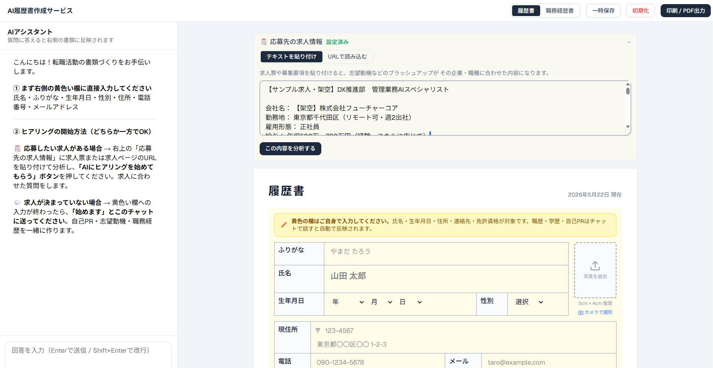
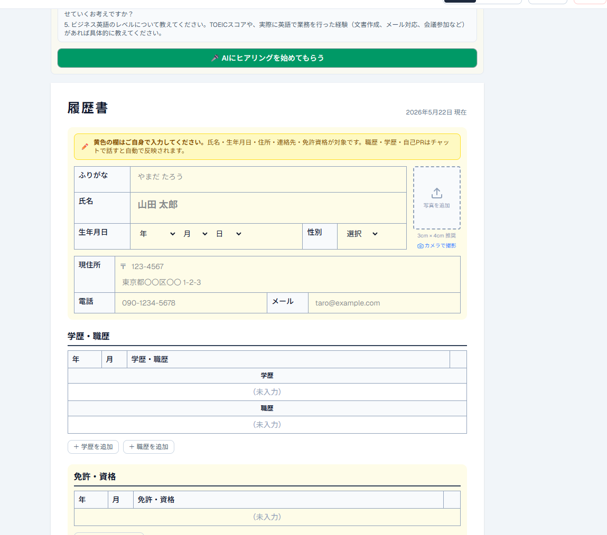
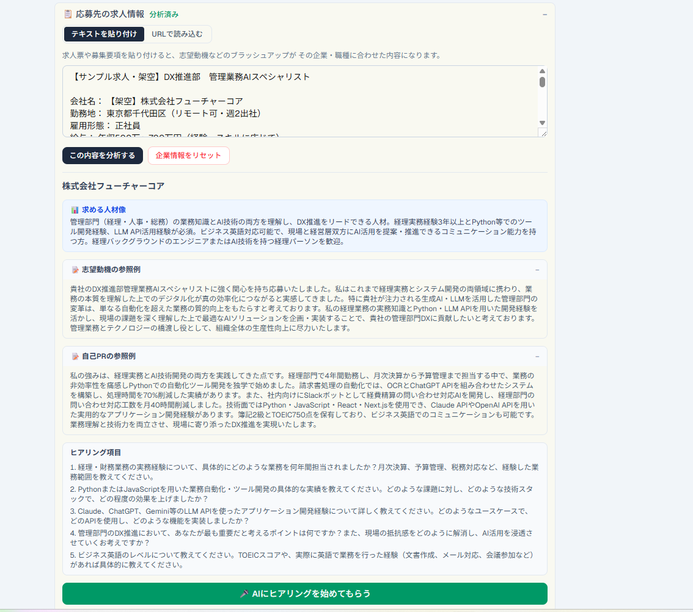

# ResuMate（レジュメイト）

**AIとの対話で、採用担当者に響く「履歴書・職務経歴書」を一緒に仕上げるWebサービス。**

質問に答えていくだけで、自己PR・志望動機・職務経歴がきれいな書類に整っていきます。求人票を貼り付ければ、その企業に合わせた質問とアドバイスもしてくれます。



---

## ✨ 特徴

- **対話で書類が完成** — キャリアアドバイザー役のAIがヒアリングし、話した内容が右側の書類に自動で反映されます。
- **求人票に合わせた最適化** — 求人ページのURLやテキストを読み込ませると、企業が求める人物像を分析し、それに沿った質問・志望動機・自己PRを提案します。
- **ワンクリックでブラッシュアップ** — 書いた文章を「採用担当者に響く文章」へAIが磨き上げます。
- **履歴書＋職務経歴書の両対応** — タブひとつで切り替え。証明写真のカメラ撮影（背景色・ガイドライン付き）にも対応。
- **印刷 / PDF出力** — そのまま提出できる形で書き出せます。
- **入力は自動保存** — ブラウザに一時保存され、続きから作業できます。
- **🔑 自分のAPIキーで動く（BYOK）** — **Anthropic（Claude）** または **OpenAI（ChatGPT）** のお好きな方を選び、ご自身のAPIキーを入力して利用します。キーは**お使いのブラウザの中だけ**に保存され、運営側のサーバーには保存されません。

---

## 🖼️ スクリーンショット

| 履歴書フォーム | 求人票の分析 |
| :---: | :---: |
|  |  |

| 証明写真のカメラ撮影 | 職務経歴書 |
| :---: | :---: |
|  |  |

---

## 🚀 使い方

1. 画面右上の **「⚙️ APIキー設定」** を開き、プロバイダ（Anthropic / OpenAI）を選んでご自身のAPIキーを入力します。
   - Anthropic のキー: https://console.anthropic.com/settings/keys
   - OpenAI のキー: https://platform.openai.com/api-keys
2. 右側の黄色い欄に、氏名・生年月日・住所・連絡先など基本情報を入力します。
3. ヒアリングを始めます（どちらか一方でOK）。
   - **応募したい求人がある場合**: 「応募先の求人情報」に求人票またはURLを貼り付けて分析 → 「AIにヒアリングを始めてもらう」。
   - **求人が決まっていない場合**: チャットに「始めます」と送信。
4. AIの質問に答えるだけで、自己PR・志望動機・職務経歴が書類に反映されます。
5. 必要に応じて「✨ AIブラッシュアップ」で文章を磨き、**「印刷 / PDF出力」** で書き出します。

---

## 🛠️ 技術スタック

- [Next.js 16](https://nextjs.org/)（App Router / Turbopack）+ React 19
- TypeScript
- [Vercel AI SDK v6](https://sdk.vercel.ai/) — `@ai-sdk/anthropic` / `@ai-sdk/openai`
- Tailwind CSS v4
- Zod（AIの構造化出力スキーマ）
- ホスティング: Vercel

---

## 💻 ローカルで動かす

```bash
npm install
npm run dev
# http://localhost:3000 を開く
```

APIキーはサーバー側の環境変数ではなく、**ブラウザの「⚙️ APIキー設定」から入力**します（環境変数の設定は不要です）。

---

## 🔒 APIキーの取り扱いについて

このサービスは「Bring Your Own Key（自分のキーを持ち込む）」方式です。

- 入力されたAPIキーは、利用者本人のブラウザの `localStorage` にのみ保存されます。
- AIへのリクエストのたびに、サーバーを経由してAIプロバイダへ渡されますが、**サーバー側には一切保存・記録されません**。
- 共用のパソコンを使う場合は、設定画面の「キーを削除」からいつでも消去できます。

---

*この作品は、プログラミング講座の学習成果として制作しました。*
